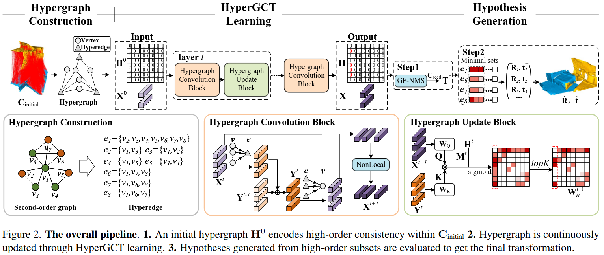

# HyperGCT: A Dynamic Hyper-GNN-Learned Geometric Constraint for 3D Registration (ICCV 2025)
Source code of [HyperGCT](). 

## Introduction
Geometric constraints between feature matches are critical in 3D point cloud registration problems. Existing approaches typically model unordered matches as a consistency graph and sample consistent matches to generate hypotheses. However, explicit graph construction introduces noise, posing great challenges for handcrafted geometric constraints to render consistency. To overcome this, we propose HyperGCT, a flexible dynamic **Hyper**-**G**NN-learned geometric **C**onstrain**T** that leverages high-order consistency among 3D correspondences. To our knowledge, HyperGCT is the first method that mines robust geometric constraints from dynamic hypergraphs for 3D registration. By dynamically optimizing the hypergraph through vertex and edge feature aggregation, HyperGCT effectively captures the correlations among correspondences, leading to accurate hypothesis generation. Extensive experiments on 3DMatch, 3DLoMatch, KITTI-LC, and ETH show that HyperGCT achieves state-of-the-art performance. Furthermore, HyperGCT is robust to graph noise, demonstrating a significant advantage in terms of generalization.


## Requirements
All experiments are conducted on RTX 3090 GPUs configured with cuda 11.8. So ``CUDA`` and ``conda`` should be installed first, then you may configure HyperGCT as:
```
conda env create -f environment.yml
conda activate HyperGCT
```
## Pretrained Model

We provide the pre-trained model of 3DMatch in `snapshot/HyperGCT_3DMatch_release` and KITTI in `snapshot/HyperGCT_KITTI_release`.

## Data Preparation

### 3DMatch / 3DLoMatch
We follow [PointDSC](https://github.com/XuyangBai/PointDSC) to generate datasets. The processed train and test sets can be found [Here](). The data should be organized as follows:

```
--data--3DMatch                
        ├── fragments                 
        │   ├── 7-scene-redkitechen/
        |   |   ├── cloud_bin_0.ply
        |   |   ├── cloud_bin_0_fcgf.npz
        |   |   ├── cloud_bin_0_fpfh.npz
        │   |   └── ...      
        │   ├── 7-scenes-redkitchen_3dlomatch/
        │   |   └── ...        
        │   └── ...                
        └── threedmatch_feat              
            ├── 7-scenes-chess@seq-01_000_fcgf.npz
            ├── 7-scenes-chess@seq-01_001_fcgf.npz
            └── ...                               
```
### KITTI-10m / KITTI-LC
We follow [LiDAR Registration Benchmark](https://github.com/HKUST-Aerial-Robotics/LiDAR-Registration-Benchmark) to generate datasets. The processed train and test sets can be found [Here](). The data should be organized as follows:

```
--data--KITTI                
        ├── fcgf_train
        |   ├── drive0-pair0_13.npz
        |   ├── drive0-pair14_25.npz
        │   └── ...  
        ├── fcgf_val
        │   └── ...  
        ├── fcgf_test
        │   └── ...  
        ├── fpfh_test
        │   └── ...  
        ├── lc_fpfh_test_0_10
        |   ├── drive0-pair0_4438.npz
        |   ├── drive0-pair3_4432.npz
        │   └── ...  
        ├── lc_fpfh_test_10_20
        │   └── ...  
        └── lc_fpfh_test_20_30
            └── ...  
```

## Instructions to training and testing
Before training and testing, you need to modify the dataset path through ``config.root`` in the following scripts.
### 3DMatch

The training and testing on 3DMatch dataset can be done by running
```bash
# train on 3DMatch
python train_3dmatch.py
# test on 3DMatch
python test_3DMatch.py --chosen_snapshot [exp_id] --descriptor FCGF --use_icp False
# test on 3DLoMatch
python test_3DLoMatch.py --chosen_snapshot [exp_id] --descriptor FCGF --use_icp False
```
where the `exp_id` should be replaced by the snapshot folder name for testing (e.g. `HyperGCT_3DMatch_release`).  The testing results will be saved in `logs/`. 

### KITTI

Similarly, the training and testing of KITTI data set can be done by running
```bash
# train on KITTI-10m
python train_KITTI.py
# test on KITTI-10m
python test_KITTI.py --chosen_snapshot [exp_id] --descriptor FPFH --use_icp False
# test on KITTI-LC
python test_KITTI.py --chosen_snapshot [exp_id] --dataset KITTI_LC --range 0_10 --use_icp False
```

## Acknowledgments
We thank the authors of 
- [PointDSC](https://github.com/XuyangBai/PointDSC)
- [SC2PCR](https://github.com/ZhiChen902/SC2-PCR)
- [MAC](https://github.com/zhangxy0517/3D-Registration-with-Maximal-Cliques)
- [VBReg](https://github.com/Jiang-HB/VBReg)

for open sourcing their methods.

## Citation
If you find this code useful for your work or use it in your project, please consider citing:

```shell

```
